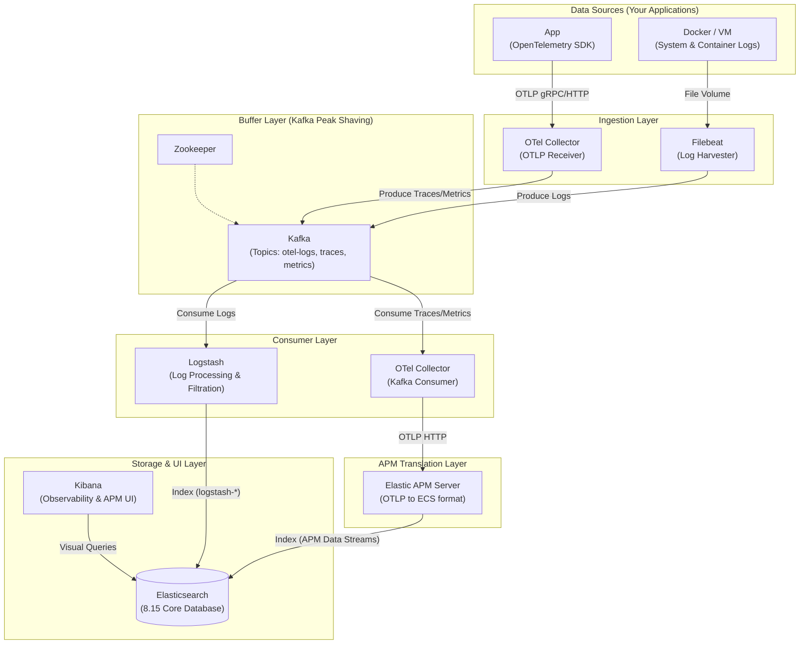

# ELK-Kafka-APM Production-Ready Architecture

This is a modern Elastic Stack observability platform with **peak shaving capability (Kafka)** and **cloud-native telemetry support (OpenTelemetry)**.

This project integrates the standard ELK Stack with Kafka acting as a buffering pool, merging the legacy Beats ecosystem seamlessly with the next-generation OpenTelemetry microservices architecture.

## 🏛️ System Architecture



---

## ✨ Design Decisions (Core Highlights)

### 1. Dual Pipeline Separation (Separation of Concerns)
*   **Logs Pipeline**: Lightweight `Filebeat` harvests standard logs, buffers them through `Kafka` to protect the DB from traffic spikes, and finally relies on `Logstash` for centralized processing before writing to Elasticsearch.
*   **Traces/Metrics Pipeline**: Utilizes the cloud-native standard `OpenTelemetry Collector` to receive all application OTLP telemetry. Data is queued into Kafka, ensuring mission-critical APM metrics are never lost during high-load periods.

### 2. Perfect Kibana APM Compatibility
Writing OTel data directly to Elasticsearch often breaks Kibana's proprietary features like the "Service Map". At the tail end of our architecture, the `OTel Collector` (acting as a Kafka consumer) passes traces to the **Elastic APM Server**, which impeccably translates the data into the native ECS format, illuminating 100% of Kibana's advanced observability features.

### 3. Automated Kafka Initialization
We avoid the dangerous `auto.create.topics.enable` mechanism. We introduced a `kafka-init` container that requests sufficient partitions during boot explicitly (e.g., granting the `otel-logs` topic 10 partitions). This drastically maximizes Logstash's parallel processing limit downstream!

### 4. Rigorous Security (RBAC & Strong Passwords)
Stepping away from weak developmental passwords. Leveraged by the `setup` initialization script, strong randomized passwords are auto-configured for built-in accounts (`logstash_internal`, `kibana_system`, etc.), bundled with strict role-based access controls to guarantee that each component dictates data only to strictly permitted indices.

---

## 🚀 Quick Start & Operations

### 1. Initialize Security & Passwords
This command establishes the Elasticsearch cluster and executes the `setup` container to cement strong passwords. By using `run --rm`, the setup container automatically cleans itself up after completion to prevent leaving "ghost" containers behind:
```bash
sudo docker compose run --rm setup
```

### 2. Spin Up Microservice Pipeline
```bash
sudo docker compose up -d
```
This awakens all microservices including Filebeat, Kafka, OTel Collector, Logstash, and Kibana. The `kafka-init` container will safely coordinate the topic partitioning and then exit automatically.

### 3. Graceful Shutdown
To bring the entire cluster down and ensure no orphaned profile containers (such as the initialized scripts) are left hanging in your environment, always use:
```bash
sudo docker compose down --remove-orphans
```

### 4. How to Access
- **Kibana Dashboard**: [http://localhost:5601](http://localhost:5601)
  - Username: `elastic`
  - Password: The strong password defined in `.env` (default is `changeme`)
- **App Integration OTel Endpoints (Traces / Metrics)**: 
  - gRPC: `localhost:4317`
  - HTTP: `localhost:4318`

---

## 📊 Kibana Verification Workflow

Once the pipeline is active and your application is producing telemetry, you can effortlessly verify the **"Three Pillars of Observability"** directly within Kibana's native UI:

### 1. Verifying Logs
1. From the left navigation menu, go to **Observability -> Logs**.
2. Since we carefully configured Logstash to inject payload into standard ECS data streams, your Docker logs will instantly stream here without requiring manual Index Pattern mappings!
3. Check the **Overview** dashboard to see the *Logs rate per minute* histogram. Bars in the graph confirm that the `Filebeat -> Kafka -> Logstash` pipeline is perfectly intact.

### 2. Verifying Traces (APM)
1. Navigate to **Observability -> APM -> Services**.
2. If your OpenTelemetry Traces successfully transited the Kafka buffer and appropriately translated via the APM Server, you will see your microservices immediately populated here.
3. Select any service to explore detailed **Transactions** (for exact endpoint latency distribution) and explore the **Dependencies** tab for the auto-generated Service Map topology architecture.

### 3. Verifying Metrics
1. Navigate to **Observability -> Metrics > Inventory**.
2. If infrastructure or custom OTel application metrics are flowing properly via the `otel-metrics` topic, they will index securely into ECS unified standards.
3. The UI will render high-level visual "Waffle Maps" depicting the live CPU usage, Memory, and System Load of your connected environments.
