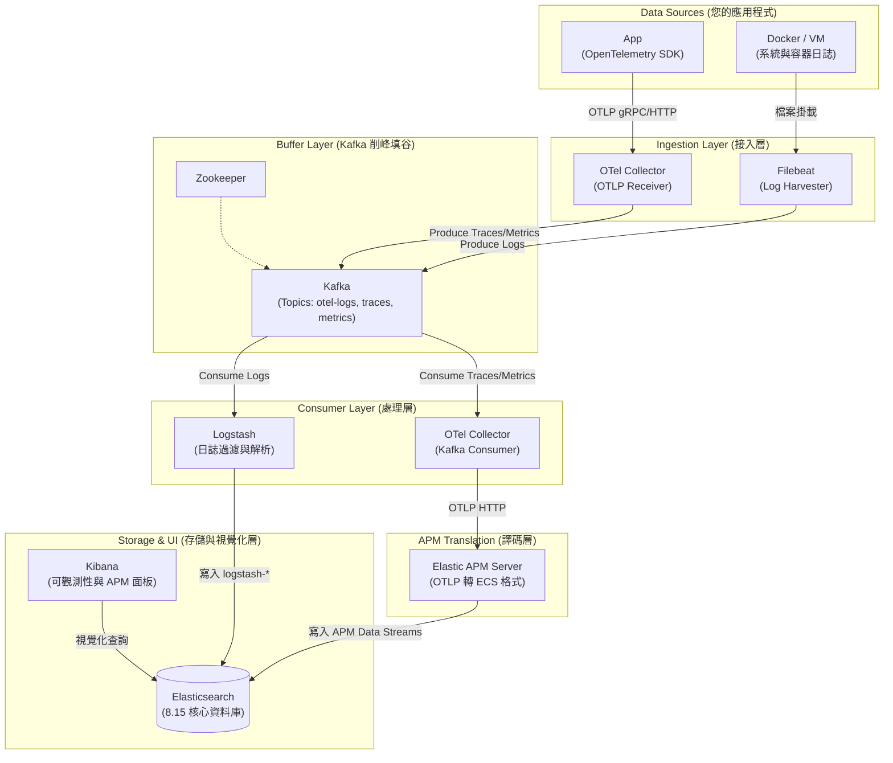

# ELK-Kafka-APM Production-Ready Architecture

這是一套具備 **超高並發吞吐量 (Peak Shaving)** 以及 **原生雲端遙測支援 (OpenTelemetry)** 的現代化 Elastic Stack 觀測性平台。

本專案將標準的 ELK Stack 結合了 Kafka 作為削峰緩衝池，並將以往龐大的 Beats 生態系與新一代的 OpenTelemetry 進行了深度的微服務架構整合。

## 🏛️ 系統架構圖 (System Architecture)



---

## ✨ 核心設計亮點 (Design Decisions)

### 1. 雙軸管線分離 (Separation of Concerns)
*   **Logs 管線**: 由輕量的 `Filebeat` 蒐集，經過 `Kafka` 緩衝保護 DB 不被瞬間海量 Log 衝垮，最後交給 `Logstash` 集中過濾處理並寫入 Elasticsearch。
*   **Traces/Metrics 管線**: 運用雲原生標準的 `OpenTelemetry Collector` 負責接收所有應用程式的 OTLP 數據。同樣送入 Kafka 排隊，確保高流量時 APM 的數據不會遺失。

### 2. 完美相容 Kibana APM
傳統直接將 OTel 資料寫入 ES 往往會喪失 Kibana 特有的「服務拓樸圖 (Service Map)」。我們在架構的最末端，讓消費 Kafka 的 OTel Collector 將資料轉交給 **Elastic APM Server** 進行格式完美轉譯，100% 點亮 Kibana 的進階可觀測性功能。

### 3. Kafka 自動化初始化機制
避免使用危險的 `auto.create.topics.enable` 機制。我們引進了 `kafka-init` 容器，在系統啟動時主動去跟 Kafka 要足夠的 Partitions (例如給予 otel-logs 10 個分區)，這大幅提升了下游 Logstash 擴展作平行處理的極限！

### 4. 嚴謹的安全性 (RBAC & 強密碼)
擺脫測試用的弱密碼。藉由 `setup` 初始化腳本，系統啟動時會自動針對 `logstash_internal`, `kibana_system` 等內建帳號設定亂數強密碼，並透過嚴格角色權限規範每個元件僅能寫入特定的 Index。

---

## 🚀 快速啟動 (Quick Start)

### 1. 初始化安全性密碼設置
這將建立 Elasticsearch 叢集並掛載 `setup` 容器去洗出強密碼：
```bash
sudo docker compose --profile setup up -d
```
> **提示**: 等待幾秒鐘確保密碼與角色設置完畢。若要觀察進度可使用 `docker compose logs setup`。

### 2. 啟動完整微服務管線
```bash
sudo docker compose up -d
```
這個指令將喚醒包含 Filebeat、Kafka、OTel Collector、Logstash 以及 Kibana 共 8 個微服務元件。`kafka-init` 也會自動完成 Topic 分區劃分後退出。

### 3. 如何存取
- **Kibana 儀表板**: [http://localhost:5601](http://localhost:5601)
  - 帳號：`elastic`
  - 密碼：定義在 `.env` 當中的強密碼 (預設為 `changeme`)
- **應用程式整合 OTel 端點 (Traces / Metrics)**: 
  - gRPC: `localhost:4317`
  - HTTP: `localhost:4318`
