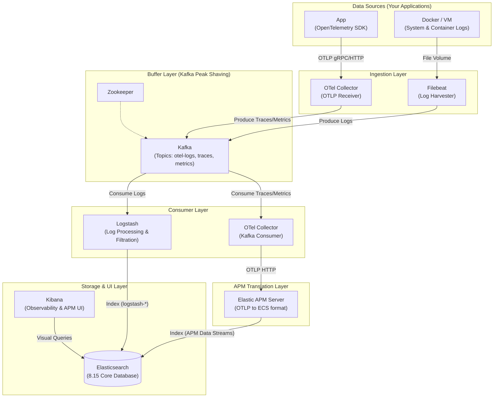

# ELK-Kafka-APM Production-Ready Architecture

This is a modern Elastic Stack observability platform with **peak shaving capability (Kafka)** and **cloud-native telemetry support (OpenTelemetry)**.

This project integrates the standard ELK Stack with Kafka acting as a buffering pool, merging the legacy Beats ecosystem seamlessly with the next-generation OpenTelemetry microservices architecture.

## 🏛️ System Architecture



---

## ✨ Design Decisions (Core Highlights)

### 1. Dual Pipeline Separation (Separation of Concerns)
*   **Logs Pipeline**: Lightweight `Filebeat` harvests standard logs, buffers them through `Kafka` to protect the DB from traffic spikes, and finally relies on `Logstash` for centralized processing before writing to Elasticsearch.
*   **Traces/Metrics Pipeline**: Utilizes the cloud-native standard `OpenTelemetry Collector` to receive all application OTLP telemetry. Data is queued into Kafka, ensuring mission-critical APM metrics are never lost during high-load periods.

### 2. Perfect Kibana APM Compatibility
Writing OTel data directly to Elasticsearch often breaks Kibana's proprietary features like the "Service Map". At the tail end of our architecture, the `OTel Collector` (acting as a Kafka consumer) passes traces to the **Elastic APM Server**, which impeccably translates the data into the native ECS format, illuminating 100% of Kibana's advanced observability features.

### 3. Automated Kafka Initialization
We avoid the dangerous `auto.create.topics.enable` mechanism. We introduced a `kafka-init` container that requests sufficient partitions during boot explicitly (e.g., granting the `otel-logs` topic 10 partitions). This drastically maximizes Logstash's parallel processing limit downstream!

### 4. Rigorous Security (RBAC & Strong Passwords)
Stepping away from weak developmental passwords. Leveraged by the `setup` initialization script, strong randomized passwords are auto-configured for built-in accounts (`logstash_internal`, `kibana_system`, etc.), bundled with strict role-based access controls to guarantee that each component dictates data only to strictly permitted indices.

---

## 🚀 Quick Start

### 1. Initialize Security & Passwords
This command establishes the Elasticsearch cluster and executes the `setup` container to cement strong passwords:
```bash
sudo docker compose --profile setup up -d
```
> **Tip**: Wait a few seconds for the initialization to complete. You can monitor the progress with `docker compose logs setup`.

### 2. Spin Up Microservice Pipeline
```bash
sudo docker compose up -d
```
This awakens all 8 microservices including Filebeat, Kafka, OTel Collector, Logstash, and Kibana. The `kafka-init` will also automatically exit once topic partitioning succeeds.

### 3. How to Access
- **Kibana Dashboard**: [http://localhost:5601](http://localhost:5601)
  - Username: `elastic`
  - Password: The strong password defined in `.env` (default is `changeme`)
- **App Integration OTel Endpoints (Traces / Metrics)**: 
  - gRPC: `localhost:4317`
  - HTTP: `localhost:4318`
